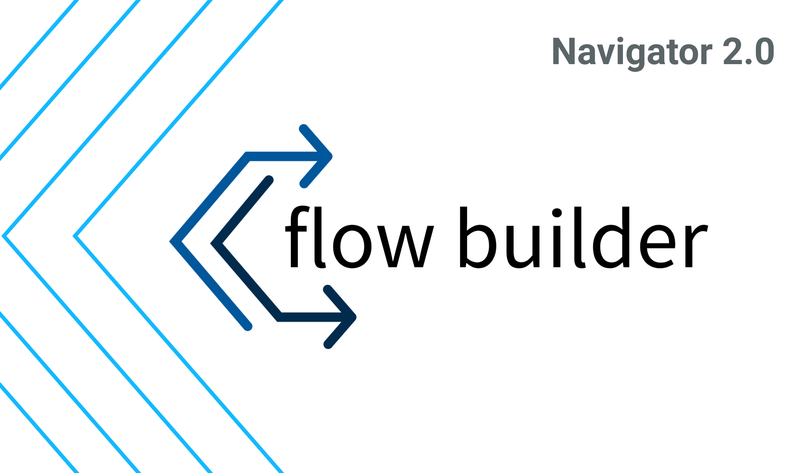
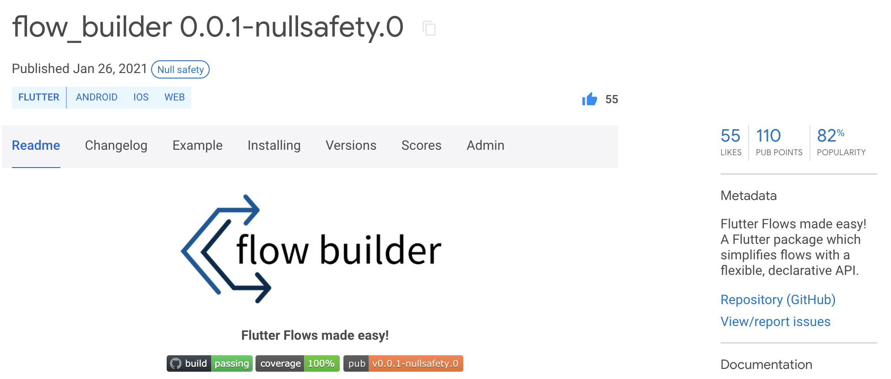
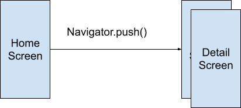
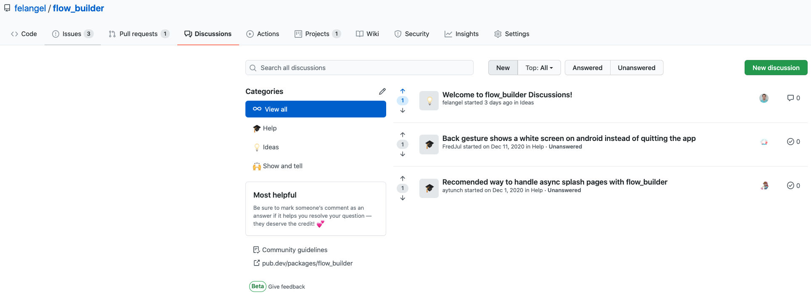
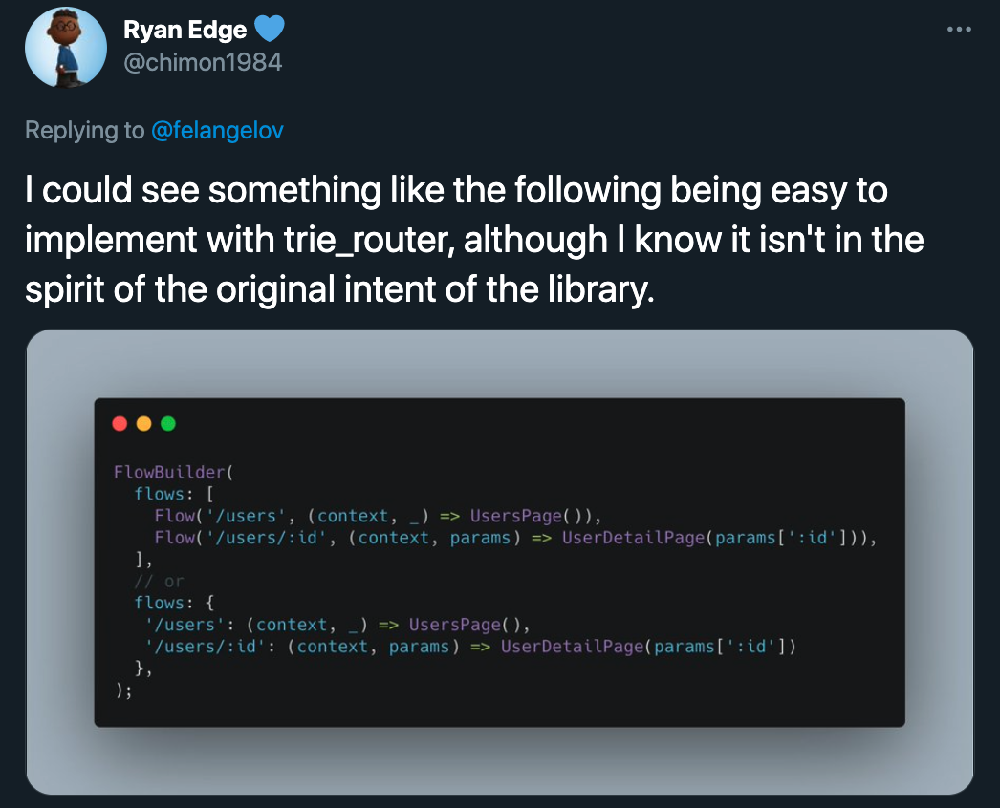

footer: @felangelov - Flutter Hub Meetup 2021
slidenumbers: true



### Go with the Flow using Navigator 2.0

#### Felix Angelov @ Very Good Ventures

---

# Very Good Ventures, Chicago 🕶️🦄


### [https://verygood.ventures](https://verygood.ventures)

---

# Agenda

- 🚰 Intro to FlowBuilder
- 🎓 How to use it
- 🐱‍💻 Demo

---

# package:flow_builder



---

# What is FlowBuilder? 🙋

## ❓❓❓

---

## Navigator 2.0 Pages API Abstraction

---

## In Depth Look at Navigator 2.0


### https://youtu.be/GxoFl5kzJgE

---

# Why Navigator 2.0 Pages API Abstraction?



---

# Why Navigator 2.0 Pages API Abstraction?

```dart
// Return a Navigator with a list of Pages representing the current app state.
return Navigator(
  key: navigatorKey,
  onPopPage: _handlePopPage,
  pages: [
    MaterialPageBuilder(
      key: ValueKey<String>('home'),
      builder: (context) => HomePageWidget(),
    ),
    if (state.searchQuery != null)
      MaterialPageBuilder(
        key: ValueKey<String>('search'),
        builder: (context) => SearchPageWidget(),
      ),
    if (state.stockSymbol != null)
      MaterialPageBuilder(
        key: ValueKey<String>('details'),
        builder: (context) => DetailsPageWidget(),
      ),
  ],
);
```

---

# Why Navigator 2.0 Pages API Abstraction?

"We hope that you’ll join us in exploring what a higher-level API built on top of these features can do for users."

- John Ryan

---

# Why FlowBuilder?

- Small API Surface
- Pages = Function(State)
- Decouple Routing Logic from Widget Tree
- Flexible, Declarative API

---

# Why FlowBuilder Cont.?

- Handles System Navigation
  - Android Hardware Back
  - iOS Edge Swipe
- Use alone or with existing state management
- Unit Test Routing Logic
- Widget Test Flows

---

# How do I use it? 🤔

---

# Add package:flow_builder

- Add the dependency to your `pubspec.yaml`

```yaml
dependencies:
  flow_builder: ^0.0.1-dev.13
```

```sh
$ flutter packages get
```

---

# Define Flow State

```dart
class Profile {
  const Profile({this.name, this.age});

  final String name;
  final int age;

  Profile copyWith({String name, int age}) {
    return Profile(
      name: name ?? this.name,
      age: age ?? this.age,
    );
  }
}
```

- What is driving the navigation?

---

# Create a FlowBuilder

```dart
return FlowBuilder(
  state: const Profile(),
  onGeneratePages: (Profile state, List<Page> pages) {
    return [
      ProfileName.page(),
      if (state.name != null) ProfileAge.page(),
    ];
  },
);
```

- Think of it like a `Navigator` widget

---

# 💡 Tip: Create Static Page Methods

```dart
class ProfileName extends StatefulWidget {
  static MaterialPage page() => MaterialPage(child: ProfileName());

  @override
  _ProfileNameState createState() => _ProfileNameState();
}

// Later...
final page = ProfileName.page();
```

---

# 💡 Tip: Extract Routing Logic

```dart
return FlowBuilder(
  state: const Profile(),
  onGeneratePages: onGenerateProfilePages,
);

// Easy to Unit Test the Routing Logic
List<Page> onGenerateProfilePages(Profile state, List<Page> pages) {
  return [
    ProfileName.page(),
    if (state.name != null) ProfileAge.page(),
  ];
}
```

---

# Optionally, Provide your own FlowController

```dart
final controller = FlowController(const Profile());
...
return FlowBuilder(
  controller: controller,
  onGeneratePages: (Profile state, List<Page> pages) {
    return [
      ProfileName.page(),
      if (state.name != null) ProfileAge.page(),
    ];
  },
);
...
void dispose() {
  controller.dispose();
  super.dipose();
}
```

---

# Look Up the FlowController 👀

```dart
@override
Widget build(BuildContext context) {
  final controller = context.flow<Profile>();
}
```

- Access the `FlowController` from within the subtree using the `flow` extension on `BuildContext`

---

# Update the Flow State 🔄

```dart
OutlineButton(
  child: Text('Update Name'),
  onPressed: () {
    context.flow<Profile>().update((profile) {
      return profile.copyWith(name: 'Felix');
    });
  },
);
```

- Triggers `onGeneratePages` with the updated state.

---

# Complete the Flow 🏁

```dart
OutlineButton(
  child: Text('Update Age'),
  onPressed: () {
    context.flow<Profile>().complete((profile) {
      return profile.copyWith(age: 26);
    });
  },
);
```

- Pops the entire flow and returns the resulting state.

---

# Try it with Sound Null Safety Today! 🔒


```yaml
dependencies:
  flow_builder: ^0.0.1-nullsafety.0
```

---

# Start a Discussion! 🙌



---

# What's Next?



---

# 👩‍💻👨‍💻

# Demo Time

## https://github.com/felangel/flutter_flows

---

# 🙏 💙

# Thank You!
